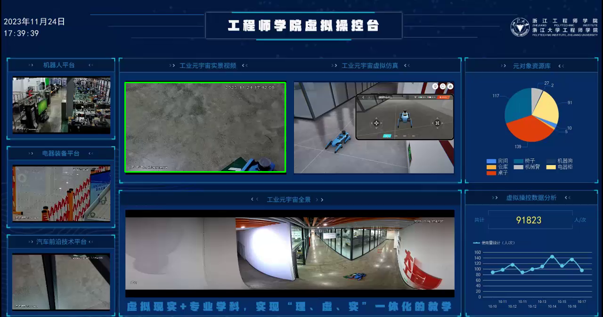

# YOLOv8实现机器狗检测

## 裁剪v3.mp4

### 定位需要裁剪的部分

运行`python locate.py`会在视频第一帧上绘制一个绿框，并保存一张名为`locate.png`的图片，多次调节参数从而确定最佳的裁剪方式

`x, y, width, height = 265, 175, 340, 190  # x,y,width,height`，x，y为左上角顶点的横纵坐标，width为绿框的宽度，height为绿框的高度

### 使用ffmpeg裁剪视频

ffmpeg是高性能视频操作工具，较opencv原生效率高近百倍，如无ffmpeg工具，需从[官网](https://www.ffmpeg.org/download.html)下载对应架构文件后加入环境变量。

将裁剪参数填入`ffmpeg -i v3.mp4 -vf "crop=265:175:340:190" -c:a copy cut3.mp4`中crop后面即可，分别为`x,y,width,height`，Windows环境下直接`./cut.bat`运行即可

## 使用ffmpeg将视频转换为图片

运行`python video2pic.py`即可，帧率选择为command中`fps`参数

## 制作数据集

### 标注数据集
使用labelImg下的labelImg.exe进行数据集标注，格式选xml或txt均可，建议txt

### 无效标注清理
在数据集图片中有许多场景没有机器狗出现，针对该场景无需标注跳过即可，完成全部标注后，运行命令`python cleanup.py`即可自动删除未标注图片和重命名图片及标注

### 数据增强
**TODO**

## 训练

### 配置YOLOv8
运行`python config.py`，将数据集进行切分，分为train、valid和test三个数据集，并生成`config.yaml`文件供yolo训练使用

### 训练YOLOv8
**TODO**

**backup是原始数据集和标注备份**